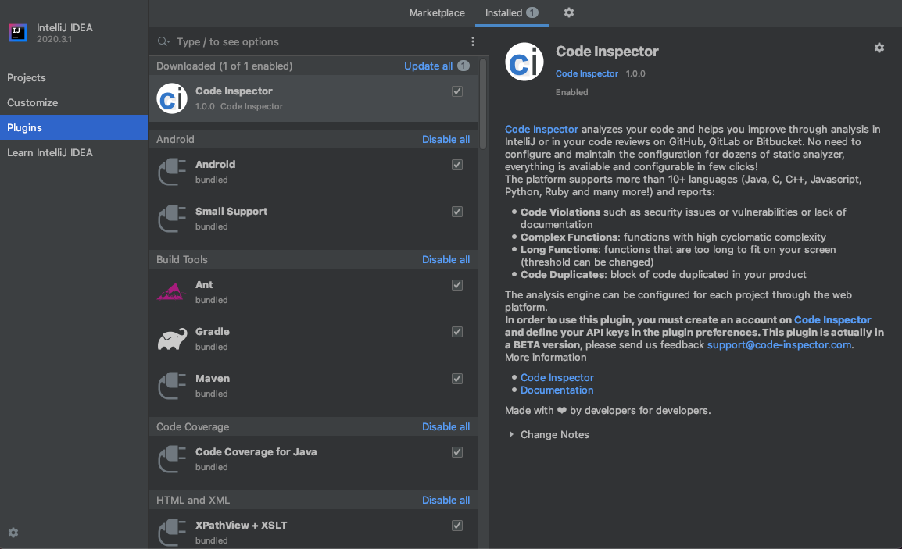
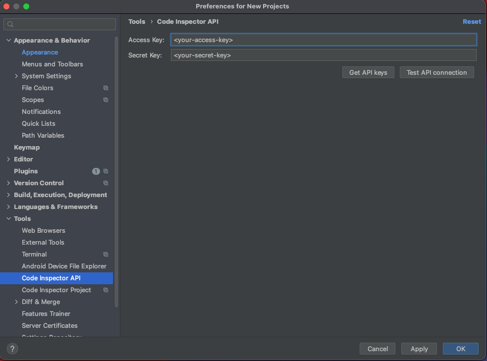
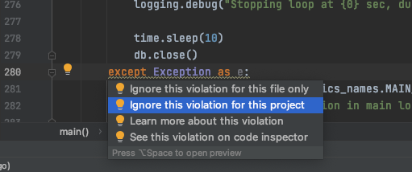

# Code Inspector Plugin for IntelliJ

This is the source code for the IntelliJ plugin for Code Inspector.

You can watch a [short description of the plugin](https://www.youtube.com/watch?v=ecGhMpynHXQ).

## Quick Start

You need to have an account on [Code Inspector](https://www.code-inspector.com) and have your project
inspected by Code Inspector. Once done, get your API keys on Code Inspector on 
[your profile page](https://frontend.code-inspector.com/account/profile). 

Once the API keys are validated, you associate your Code Inspector project with your IntelliJ project as shown
below.

Code Inspector will annotate your source code and surface all issues it detects. You can select to learn more
about each violation, see them on Code Inspector or just ignore it.

## Features

 * Surface Code Inspector Issues in IntelliJ
 * Ability to ignore violations directly within IntelliJ
 * Direct link between Code Inspector and the IntelliJ editor

## Architecture

There are two stores for the preferences of this plugin

 * **Application-level**: preferences for the application to store and get the access and secret keys
 * **Project-level**: preferences that stores what project is being used.

Then, once the project is selected, annotations for each file on Code Inspector
are being surfaced within the IDE.

## Dependencies

 * [apollo-android](https://github.com/apollographql/apollo-android) 
   to access the [Code Inspector GraphQL API](https://doc.code-inspector.com/docs/api/)

## License

This project is under the GPL-3. See the LICENSE file for more information.

## Contact

If you have any bugreport: support@code-inspector.com