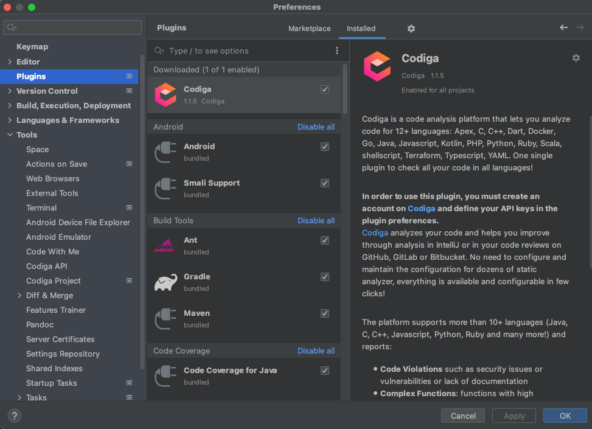
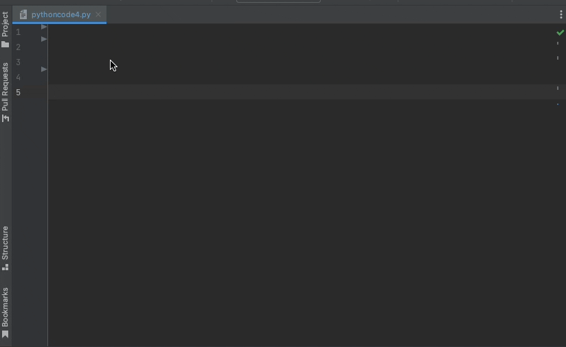
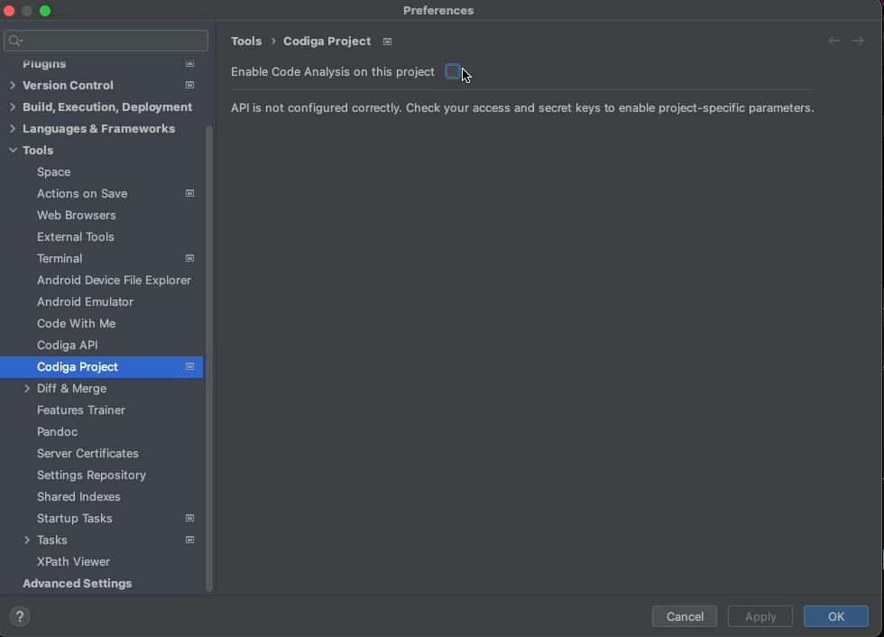

# Codiga Plugin for Jetbrains products

This is the source code for the Jetbrains plugin for Codiga.

Codiga provides two main functionalities:

 - **Coding Assistant**: import reusable code blocks based on your context
 - **Code Analysis**: no-configuration code analysis for 12+ languages

It is available on the [Jetbrains marketplace](https://plugins.jetbrains.com/plugin/17969-codiga) 
and you can install it directly within any Jetbrains product (IntelliJ, PHPStorm, PYCharm, etc).

## Quick Start

Go in the plugin section of your Jetbrains product and look for "Codiga" on the marketplace.

### Use the Coding Assistant

You can trigger the coding assistant by either

 - Use the shortcut control + alt + C
 - Use the menu item as shown below

### Creating and sharing reusable code blocks

 1. Select the code in your editor
 2. Right click on "Create Codiga Recipe"

### Code Analysis

Codiga analyses your code and surfaces any issue. It works for 12+ languages. Codiga annotates directly You can select to learn more
about each violation, see them on Code Inspector or just ignore it.

You can select to disable the code analysis directly in the project preference, as shown below.

## Connecting your Codiga Account

You can connect your Codiga account in order to 

 1. use the code recipes and cookbooks you define and subscribe to
 2. use all your code analysis preferences on Codiga

In order to link your Codiga account, you need to add your API token to your preferences.
First, go on our application and generate an API token as shown below.

Then, enter your API token in the Jetbrains plugin configuration, as shown below.

Once the token is added, click on "Apply" and then "Test API connection".

# Implementation concerns

## Dependencies

 * [apollo-android](https://github.com/apollographql/apollo-android) 
   to access the [Code Inspector GraphQL API](https://doc.codiga.io/docs/api/)

## License

This project is under the GPL-3. See the LICENSE file for more information.

## Contact

If you have any bugreport, submit an issue directly on the [GitHub issue tracker](https://github.com/codiga/jetbrains-plugin/issues).